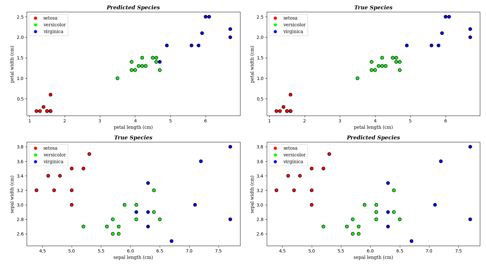
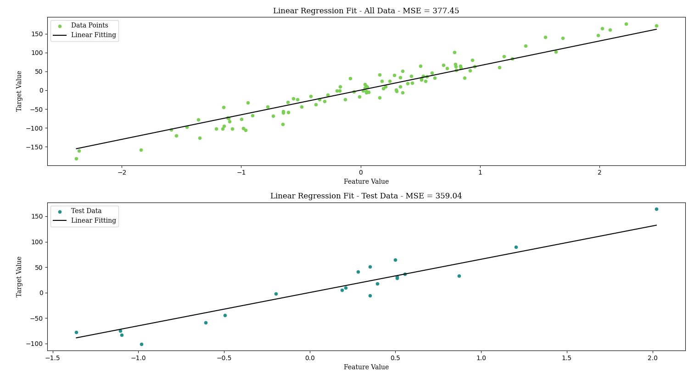
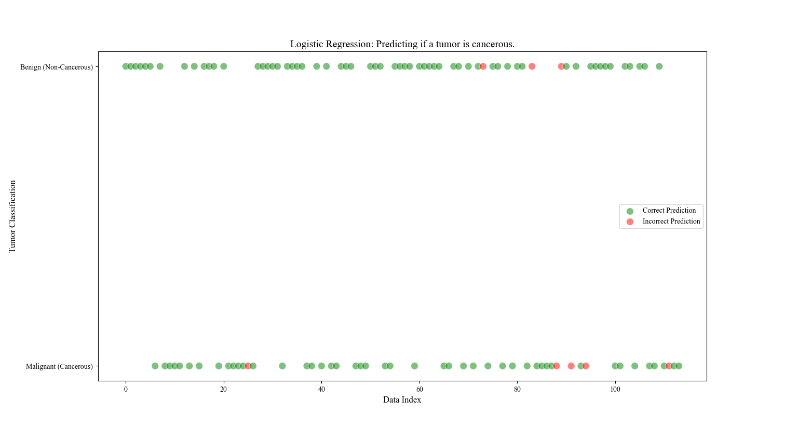

### [Machine Learning From Scratch](https://www.youtube.com/playlist?list=PLcWfeUsA

ys2k_xub3mHks85sBHZvg24Jd)

---

**_KNN_**

Iris classification accuracy (k=5) = 96.67%:

---

**_Linear Regression_**

LinearRegression(learning_rate=0.01, number_of_iterations=100) -> MSE = 359.04

LinearRegression(learning_rate=0.001, number_of_iterations=500) -> MSE = 305.77

---

**_Logistic Regression_**

LogisticRegression(learning_rate=0.001, n_iterations=1000) -> accuracy = 89.47%

LogisticRegression(learning_rate=0.0001, n_iterations=5000) -> accuracy = 92.98%

---

**_Decision Tree_**

DecisionTree(max_depth=10) -> accuracy: 90.35%

DecisionTree(max_depth=30) -> accuracy: 93.86%

---

**_Random Forest_**

RandomForest(n_trees=10, max_depth=10, min_samples_split=2) -> accuracy = 92.98%

